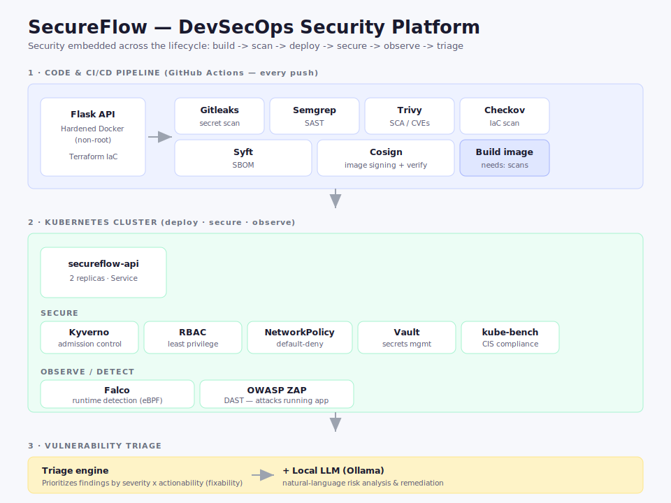

# SecureFlow — DevSecOps Security Platform

An end-to-end DevSecOps project that takes a containerized application and embeds
security into every stage of its lifecycle: build, scan, deploy, secure at runtime,
and triage findings. Built hands-on to demonstrate practical DevSecOps, cloud-native
security, and supply-chain security skills.

## What this demonstrates

Security is integrated across the entire software delivery lifecycle — embedded at
every stage rather than bolted on at the end. The project implements the core
practices of modern DevSecOps: secure CI/CD pipelines, static and dynamic application
security testing (SAST/DAST), software composition analysis (SCA), infrastructure-as-code
scanning, container and supply-chain security, Kubernetes hardening, secrets management,
runtime threat detection, and automated vulnerability triage.

## Architecture

Flow: **Build → Scan (CI/CD) → Deploy (Kubernetes) → Secure → Observe → Triage**

- **Application:** Python Flask API, containerized with a hardened, non-root Docker image
- **Infrastructure as Code:** Terraform provisions a local Kubernetes (kind) cluster
- **CI/CD:** GitHub Actions pipeline runs the security toolchain automatically on every push

## Security toolchain

### CI/CD pipeline (runs on every push — live and passing on GitHub Actions)
| Stage | Tool | Purpose |
|-------|------|---------|
| Secret scanning | Gitleaks | Detect committed secrets/keys |
| SAST | Semgrep | Find vulnerabilities in source code |
| SCA | Trivy | Find CVEs in dependencies and image |
| IaC scanning | Checkov | Find infrastructure misconfigurations |
| SBOM | Syft | Generate software bill of materials |
| Image signing | Cosign | Sign image + verify (supply-chain integrity) |

### Kubernetes runtime security
| Layer | Tool | Purpose |
|-------|------|---------|
| Admission control | Kyverno | Block non-compliant deployments (e.g. root containers) |
| Access control | RBAC | Least-privilege service account permissions |
| Network | NetworkPolicy | Default-deny traffic, explicit allow for the API |
| Compliance | kube-bench | CIS Kubernetes Benchmark scan |
| Secrets management | Vault | Store, retrieve, and rotate secrets |
| Runtime detection | Falco | Real-time threat detection (kernel/eBPF) |
| DAST | OWASP ZAP | Attack the running app for HTTP-layer issues |

### Vulnerability triage
- **triage.py / ai_triage.py** — prioritizes scan findings by severity label and
  actionability (fixability), with an optional local LLM (Ollama) layer for
  natural-language risk analysis and remediation advice.

## Key security concepts demonstrated

- **Shift-left:** security checks run early and automatically in CI/CD
- **Defense in depth:** overlapping controls (image hardening, admission control,
  RBAC, network policy, runtime detection)
- **Least privilege / blast-radius limiting:** non-root containers, scoped RBAC,
  default-deny networking
- **Supply-chain security:** SBOM generation and image signing with tamper verification
- **Prevention + detection:** admission control prevents bad deploys; Falco detects
  runtime intrusions that bypass prevention
- **Risk-based triage:** prioritizing by actionable risk, not raw severity

## Accepted / documented findings

- `terraform.tfstate` contains a provider-generated private key — gitignored, never
  committed. In production, state would live in an encrypted remote backend.
- Semgrep flags `host="0.0.0.0"` — intentionally suppressed with justification
  (required for container networking; exposure controlled at the Kubernetes layer).
- Several base-image CVEs are `fix_deferred`/unpatchable — documented and monitored;
  a distroless base image would reduce these.

## Repository structure

- `app/api/` — Flask application and hardened Dockerfile
- `infra/` — Terraform, Kubernetes manifests, Kyverno policies, RBAC, network policies
- `.github/workflows/ci.yml` — the CI/CD security pipeline
- `docs/` — scan reports and notes (kube-bench, Falco, DAST, triage engine)
- `triage.py`, `ai_triage.py` — vulnerability triage engine

## Status

Core build complete. Planned next: cloud deployment (AWS/Azure) as a follow-on
project, and architecture diagram + demo.
